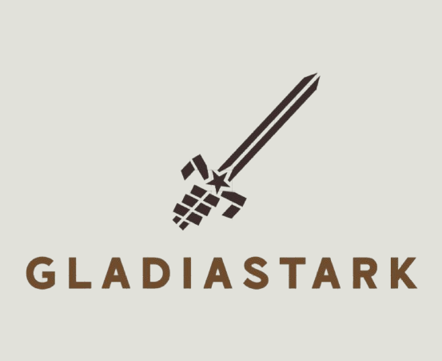
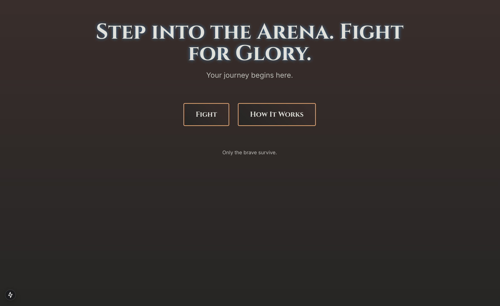
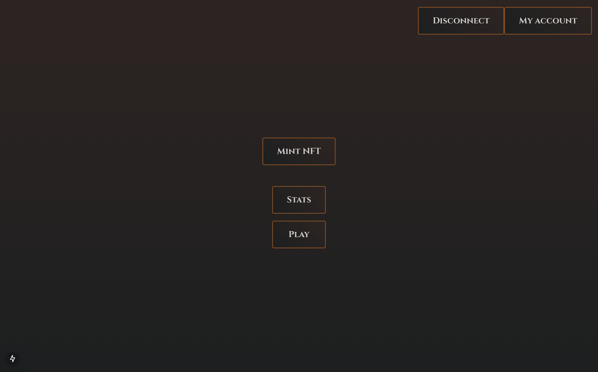
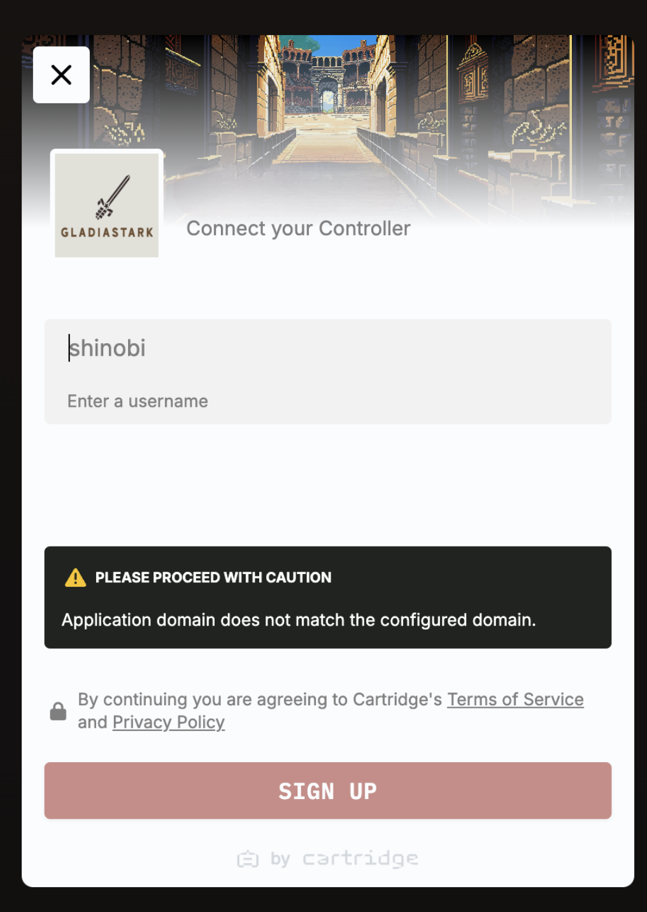
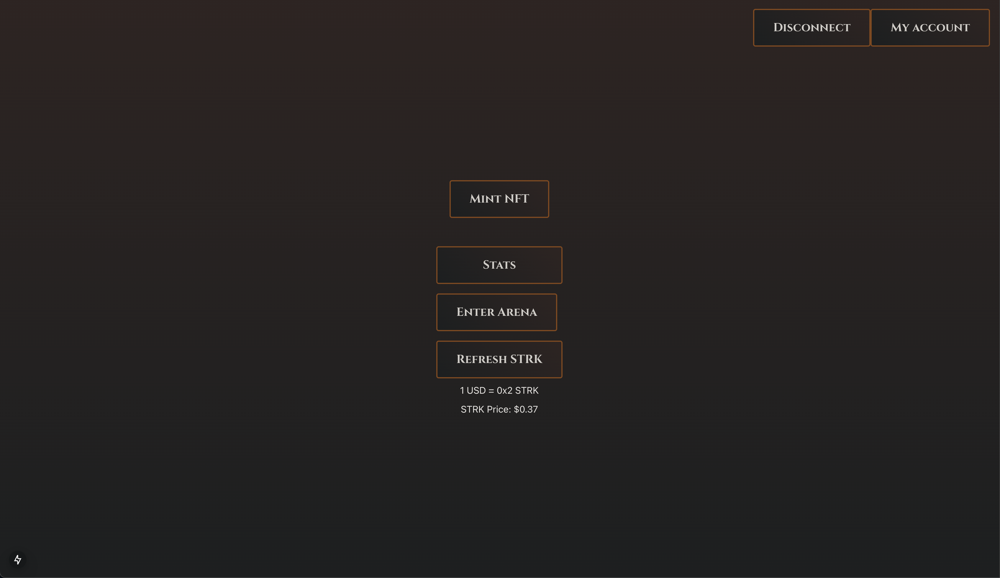

# 🎯 GladiaStark 🏆
<p align="justify">
GladiaStark is an on-chain, lottery-style game on the Starknet blockchain, combining the thrill of competition with blockchain-powered innovation. Players mint gladiator NFTs and send them into an arena to compete for a prize pool. This fun and easy-to-use app is designed to attract new users to Starknet while providing an engaging experience. GladiaStark was created during a hackathon with a focus on technical depth and user accessibility! 
</p>
<p align="center">
  
</p>


<p align="center">
  <a href="https://starkware.co/hackathon/">
    
  </a>
  <a href="https://starkware.co/starknet/">
    
  </a>
</p>


## 📋 Table of Contents
- [🎯 GladiaStark 🏆](#-gladiastark-)
  - [📋 Table of Contents](#-table-of-contents)
  - [🔍 Introduction](#-introduction)
  - [✨ Features](#-features)
  - [🛠️ Tech Stack](#️-tech-stack)
  - [📦 Setup Instructions](#-setup-instructions)
    - [Prerequisites](#prerequisites)
    - [Clone the Repository](#clone-the-repository)
    - [Frontend Setup](#frontend-setup)
    - [Environment Variables](#environment-variables)
    - [Backend Setup](#backend-setup)
      - [NFT display setup using Cartridge Slot](#nft-display-setup-using-cartridge-slot)
    - [Run the Application](#run-the-application)
  - [📖 Usage](#-usage)
  - [🤝 Contributing](#-contributing)
  - [📜 License](#-license)

## 🔍 Introduction
GladiaStark transforms the concept of lottery games into a blockchain-powered experience. With a simple $1 bet, players mint digital gladiators and send them to an arena where only one emerges victorious. By leveraging Starknet's scalability and low fees, GladiaStark ensures fast and cost-efficient gameplay. 💰🎮

## ✨ Features
- 🔗 **Lottery-Style Gameplay:** Bet $1 to mint a gladiator NFT and join the arena.
- 🎯 **Fair and Transparent:** Blockchain ensures fair outcomes and transparency.
- ⚔️ **Thematic Fun:** Engage with a gladiator narrative while competing for prizes.
- 🛡️ **Secure:** Built on Starknet for low costs and high security.
- 🚀 **Accessible:** No complex wallet connections; simple username-based account creation.

## 🛠️ Tech Stack
- **Tools:**
  - Cartridge Account Abstraction
  - Cartridge Slot for NFT display
  - Pragma for PriceFeed
  - Cartridge VRF for random number generation
  - OpenZeppelin for ERC721


## 📦 Setup Instructions
### Prerequisites
Ensure the following are installed:

- Node.js (v16+)
- pnpm (v8+)

### Clone the Repository
```bash
git clone https://github.com/ratstark/GladiaStark.git
cd GladiaStark
```

### Frontend Setup
```bash
cd client
pnpm install
pnpm run dev
```
### Environment Variables
Create a `.env` file in the backend directory with the following:
```env
STARKNET_CONTRACT_ADDRESS=0x...
STARKNET_RPC_URL= https://starknet-sepolia.infura.io/...
```

Add environment variables to the `.env` file in the frontend directory:
```bash
source .env
```

### Backend Setup
```bash
cd contracts
```

#### NFT display setup using Cartridge Slot
Follow [Cartridge Slot](https://github.com/cartridge-gg/slot) setup instructions to display NFTs in the frontend.
And run this to display the nft in the frontend:
```bash
slot deployments create gladiastark torii --world 0x3fa481f41522b90b3684ecfab7650c259a76387fab9c380b7a959e3d4ac69f --rpc $STARKNET_RPC_URL --config ../torii-config.toml
```


### Run the Application
Access the frontend on `https://localhost:3000/`. 🎉

## 📖 Usage
1. Click on **Fight**



2. Click on **Connect** in top right corner



3. Enter a username and click "Create Account".
   

4. Mint a gladiator NFT.



5. Enter the arena, by paying 1$ in SRTK and wait for the fight results.
6. View stats and your winnings on the "Stats" page.

## 🤝 Contributing
We welcome contributions to GladiaStark! Follow these steps:

1. Fork the repository.
2. Create a new branch for your feature or bug fix.
3. Commit your changes.
4. Open a pull request.

Please adhere to the project’s coding style and guidelines. Contributions that enhance usability, improve the UI, or expand gameplay mechanics are particularly appreciated! 💡

## 📜 License
This project is licensed under the MIT License. See the LICENSE file for details. 📝

---


Support GladiaStark by giving it a ⭐ and sharing it with your friends! 🚀

